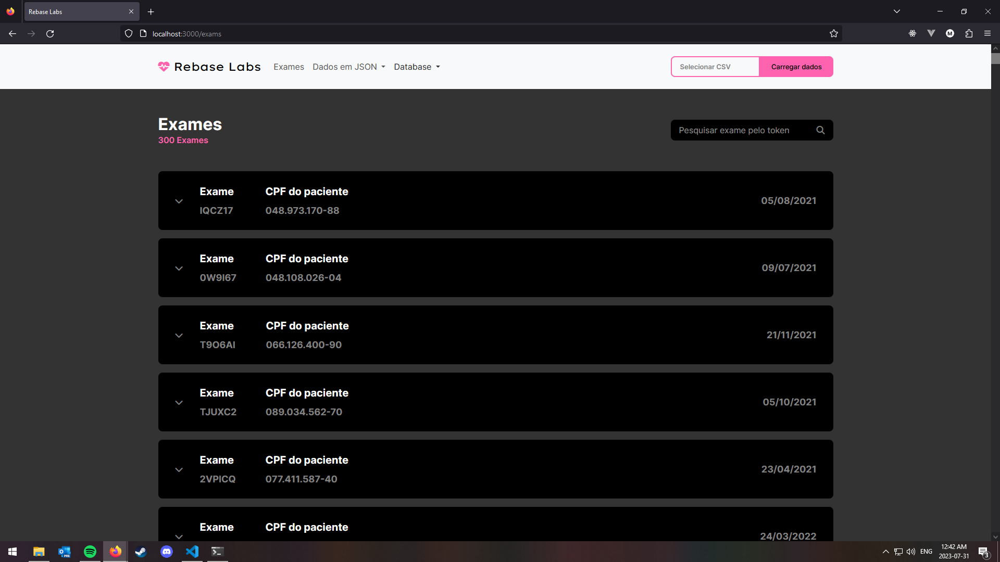
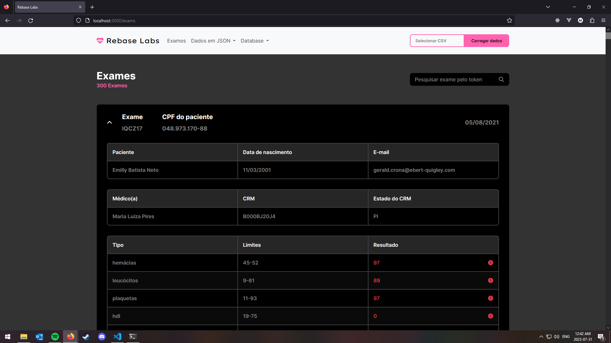
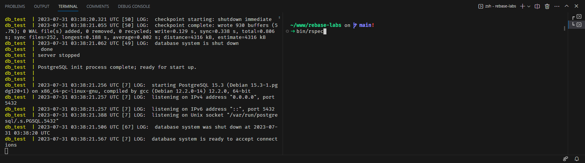
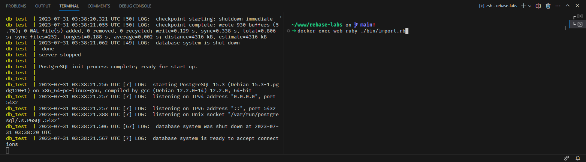
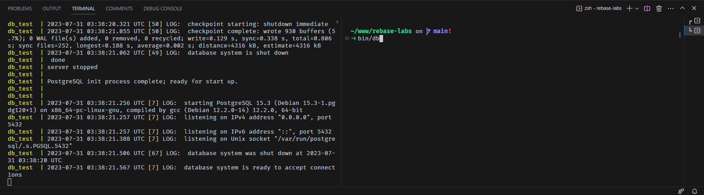
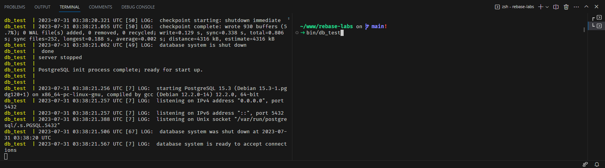

<h1 align="center">Rebase Labs</h1>

<p align="center">
  <a href="https://docs.docker.com/">
    
  </a>
  <a href="https://www.ruby-lang.org/en/">
    
  </a>
  <a href="https://developer.mozilla.org/en-US/docs/Web/JavaScript">
    
  </a>
  
  
  <a href="https://www.postgresql.org/">
    
  </a>
  <a href="https://redis.io/docs/">
    
  </a>
  <a href="https://github.com/sidekiq/sidekiq/wiki">
    
  </a>
</p>
<p align="center">
  
</p>

## Sobre o Projeto
Rebase Labs é uma app web para listagem de exames médicos que está sendo construida durante o laboratório da <a href="https://www.rebase.com.br/" target="_blank">Rebase</a> com o auxílio de profissionais incríveis da área.

<p align="center">
  
  
</p>

## Configuração e Inicialização do Projeto
Primeiramente precisamos realizar a clonagem do projeto para sua máquina local, podemos fazer isto com o seguinte comando:

Clonagem via HTTPS:
```bash
git clone https://github.com/montteiropedro/rebase-labs.git
```

Clonagem via SSH:
```bash
git clone git@github.com:montteiropedro/rebase-labs.git
```

Logo após realizar a clonagem, entre no diretório criado, podemos fazer isto com o seguinte comando:
```bash
cd rebase-labs
```

Antes de começarmos a configuração do projeto, vale salientar que as ferramentas ___Docker___ e ___Ruby___ já precisam estar instaladas em seu computador.
Com as ferramenas citadas anteriormente em mãos — e estando no diretório raiz do projeto — devemos executar o seguinte comando:

```bash
  bin/dev
```

O comando anterior irá preparar o ambiente do nosso projeto. De forma resumida este comando:
  * Baixa todas as imagens necessárias para cada container docker (No caso teremos 5 containers: ___web___, ___db___, ___db_test___, ___redis___ e ___sidekiq___)
  * Cria e configura todos os containers citados anteriormente usando as imagens baixadas
  * Inicializa os conteiners e conecta todos os containers em uma mesma rede

__Para terminar a execução do projeto, basta clicar `CTRL + C`.__

__Para iniciar o projeto novamente basta utilizar o comando `bin/dev` novamente.__ Este comando em uma primeira execução configura e inicializa e a partir do momento em que tudo já esta configurado ele apenas inicia o projeto.

__Quando a aplicação está em execução você pode acessa-lá através do seguinte endereço: http://localhost:3000__

O comando `CTRL + C` termina a execução do comando `bin/dev` mas não remove os containers. Caso você preciso removê-los, não se preocure, temos um comando preparado para está situação também:
```bash
bin/down
```

## Esta tendo problemas com o CSS?
Caso a aplicação com uma estilização meio quebrada, aguarde alguns segundos e recarregue a página limpando o cache, isso provavelmente resolverá o problema.

No Firefox/Chrome podemos recarregar a página limpando o cache da seguinte forma:
  * Aperte e segure a tecla SHIFT
  * Agora, enquanto segura a tecla SHIF, aperte o botão de recarregar a página

## Como executar os testes?
### Para executar o scripts de teste, precisaremos que a aplicação esteja em execução.
Com a aplicação rodando, devemos abrir um novo terminal também localizado no diretório raiz do projeto e em seguida rodar o comando abaixo:

```bash
bin/rspec
```
  * __No momento os testes ainda são poucos, mas vou trabalhar para aumentar o número de testes e cobertura do projeto__

<details>
  <summary>Exemplo no terminal</summary>
  
</details>

## Scripts Auxiliares
Agora vamos falar um pouco sobre os ___scripts___ que se encontram na diretório `/bin`.

### Para executar os scripts a seguir, precisaremos que a aplicação esteja em execução.

__import script__: nos possibilita fazer a importação dos dados do arquivo ___data.csv___ — que se encontra no diretório raiz do projeto — para a database principal e pode ser executado da seguinte forma:

> ```bash
> docker exec web ruby ./bin/import.rb
> ```
> 
> <details>
>   <summary>Exemplo no terminal</summary>
>   
> </details>

<br>

__db script__: nos possibilita entrar no console da database principal e pode ser executado da seguinte forma:

> ```bash
> bin/db
> ```
> 
> <details>
>   <summary>Exemplo no terminal</summary>
>   
> </details>

<br>

**db_test script**: nos possibilita entrar no console da database de testes e pode ser executado da seguinte forma:
> 
> ```bash
> bin/db_test
> ```
> 
> <details>
>   <summary>Exemplo no terminal</summary>
>   
> </details>

## Endpoints do Projeto

### Consultar todos os exames (Feature 1)
O endpoint `/api/v1/exams` é a primeira versão de consulta de exames da API. Este endpoint traz os dados de todos os exames armazenados na database porém com uma formatação diferente da segunda versão.

```bash
GET /api/v1/exams
```

Resposta:
```json
[
  {
    "cpf":"20824295048",
    "patient_name":"John Doe",
    "patient_email":"john@email.com",
    "patient_birthday":"2001-03-11",
    "patient_address":"165 Rua Rafaela",
    "patient_city":"Ituverava",
    "patient_state":"Alagoas",
    "doctor_crm":"B000BJ21J4",
    "doctor_crm_state":"PI",
    "doctor_name":"Maria Luiza Pires",
    "doctor_email":"denna@email.com",
    "exam_result_token":"TOKEN1",
    "exam_date":"2021-08-05",
    "exam_type":"hemácias",
    "limits_exam_type":"45-52",
    "result_exam_type":"97"
  },
  {...},
  {...}
]
```

### Consultar todos os exames (Feature 2)
O endpoint `/api/v2/exams` devolve listagem de exames em formato JSON. Esta listagem é utilizada pelo javascript que é chamado dentro do `index.html` que é devolvido pelo endpoint `/exams`.

O fluxo é o seguinte: o endpoint `/exams` abre o arquivo `index.html` que por sua vez chama o arquivo `main.js` que se encontra no diretório `/public`. Agora, dentro do arquivo javascript, é realizada a chamada para o nosso endpoint de interesse `/api/v2/exams`.

```bash
GET /api/v2/exams
```

Resposta:
```json
[
  {
    "cpf":"20824295048",
    "name":"John Doe",
    "email":"john@email.com",
    "birthday":"2001-03-11",
    "result_token":"TOKEN1",
    "result_date":"2021-08-05",
    "doctor":{
      "crm":"B000BJ21J4",
      "crm_state":"PI",
      "name":"Maria Luiza Pires"
    },
    "tests":[
      {"type":"hemácias", "limits":"45-52", "result":"97"},
      {"type":"leucócitos", "limits":"9-61", "result":"89"},
      {"type":"plaquetas", "limits":"11-93", "result":"97"},
      {"type":"hdl", "limits":"19-75", "result":"0"},
      {"type":"ldl", "limits":"45-54", "result":"80"},
      {"type":"vldl", "limits":"48-72", "result":"82"},
      {"type":"glicemia", "limits":"25-83", "result":"98"},
      {"type":"tgo", "limits":"50-84", "result":"87"},
      {"type":"tgp", "limits":"38-63", "result":"9"},
      {"type":"eletrólitos", "limits":"2-68", "result":"85"},
      {"type":"tsh", "limits":"25-80", "result":"65"},
      {"type":"t4-livre", "limits":"34-60", "result":"94"},
      {"type":"ácido úrico", "limits":"15-61", "result":"2"}
    ]
  },
  {...},
  {...}
]
```

### Pesquisar por exames (Feature 3)
O endpoint `/tests/:token` permite que o usuário da API pesquise por um ou mais exames fornecendo o token completo ou parte dele.
  * Caso ele informe um token completo a API retornará o exame vinculado aquele token ou nada caso o mesmo não exista na base de dado.
  * Caso ele informe o token de forma parcial a API retornará todos os exames que possuem aquela sequência exata de caracteres em seu token.

```bash
GET /api/v2/exams/T9O6AI
```

Resposta:
```json
[
  {
    "cpf":"20824295048",
    "name":"John Doe",
    "email":"john@email.com",
    "birthday":"2001-03-11",
    "result_token":"T9O6AI",
    "result_date":"2021-08-05",
    "doctor":{
      "crm":"B000BJ21J4",
      "crm_state":"PI",
      "name":"Maria Luiza Pires"
    },
    "tests":[
      {"type":"hemácias", "limits":"45-52", "result":"97"},
      {"type":"leucócitos", "limits":"9-61", "result":"89"},
      {"type":"plaquetas", "limits":"11-93", "result":"97"},
      {"type":"hdl", "limits":"19-75", "result":"0"},
      {"type":"ldl", "limits":"45-54", "result":"80"},
      {"type":"vldl", "limits":"48-72", "result":"82"},
      {"type":"glicemia", "limits":"25-83", "result":"98"},
      {"type":"tgo", "limits":"50-84", "result":"87"},
      {"type":"tgp", "limits":"38-63", "result":"9"},
      {"type":"eletrólitos", "limits":"2-68", "result":"85"},
      {"type":"tsh", "limits":"25-80", "result":"65"},
      {"type":"t4-livre", "limits":"34-60", "result":"94"},
      {"type":"ácido úrico", "limits":"15-61", "result":"2"}
    ]
  }
]
```

### Importar arquivo CSV (Feature 4)
```bash
POST /api/v1/import
```
  * O corpo desta requisição deve possuir um arquivo do tipo `text/csv`.


Resposta:
```json
{
  "message":"CSV received successfully"
}
```
